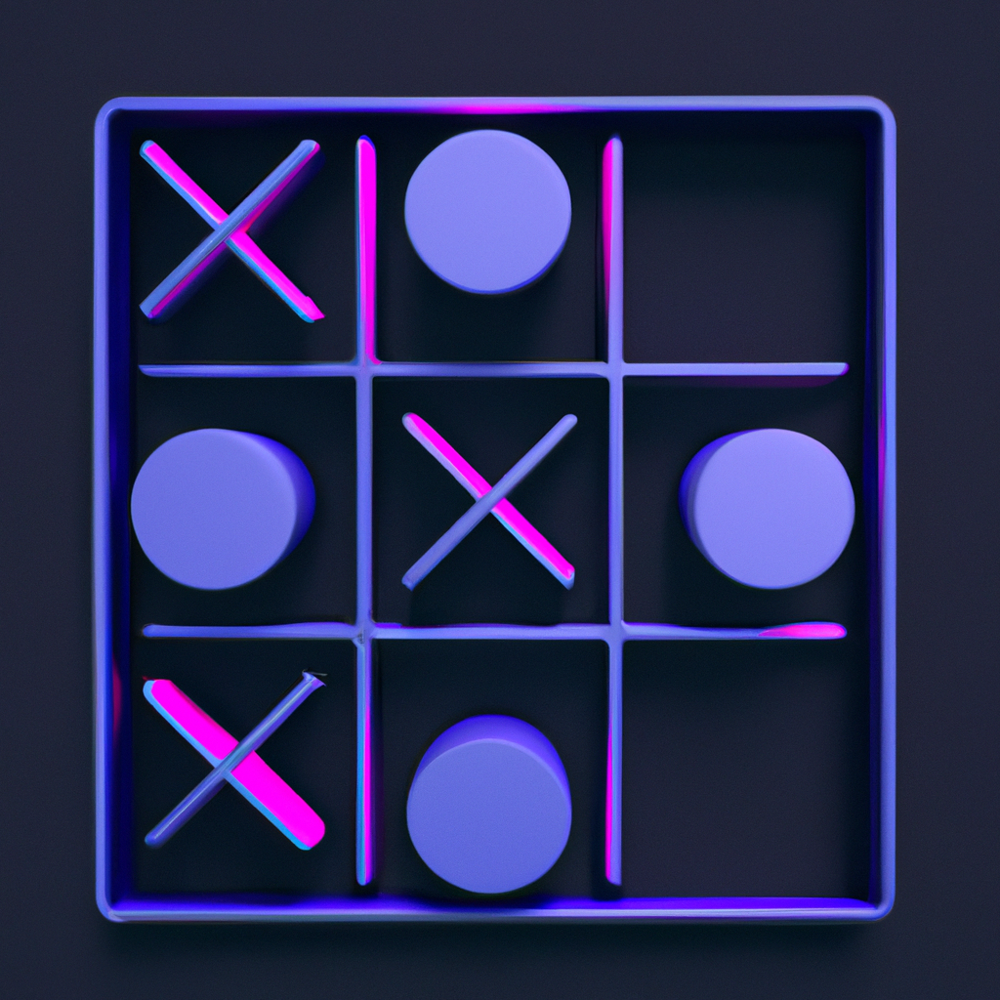

# Tic-Tac-Toe App



This is a Tic-Tac-Toe game built with Flutter, supporting iOS, Android, and Web platforms. The game comes with a dark theme and cool animations to enhance the user experience.

## Features

- Play Tic-Tac-Toe against another player
- Dark theme for a visually appealing experience
- Smooth animations to make the game more engaging

## Demo

https://github.com/Jaineel-Mamtora/Tic-Tac-Toe/assets/38665793/8dd218a5-f2f7-4b16-b79b-55a28c822b4a

## Screenshots

<table>
    <tr>
        <td>Light Theme</td>
        <td>Dark Theme</td>
    </tr>
    <tr>
        <td></td>
        <td></td>
    </tr>
</table>

## Installation

1. Make sure you have Flutter installed. If not, follow the official installation guide [here](https://flutter.dev/docs/get-started/install).

2. Clone the repository:

   ```shell
   git clone git@github.com:Jaineel-Mamtora/Tic-Tac-Toe.git
   cd Tic-Tac-Toe
   ```

3. Install the dependencies:

   ```shell
   flutter pub get
   ```

4. Run the app:

   ```shell
   flutter run
   ```

## How to Play

1. Launch the app on your device.

2. You'll see the game board with a 3x3 grid.

3. Tap on any empty cell to place your X or O, taking turns with the other player.

4. The first player to get three of their symbols in a row (horizontally, vertically, or diagonally) wins the game.

5. If all cells are filled and no player has three in a row, the game ends in a draw.

## Contributing

Contributions are welcome! If you find any bugs or have suggestions for improvements, please open an issue or submit a pull request.

## License

MIT License. See the [MIT-LICENSE](https://github.com/git/git-scm.com/blob/main/MIT-LICENSE.txt) file for details.

## Credits

The Tic-Tac-Toe game was created by [Jaineel Mamtora](https://github.com/Jaineel-Mamtora).

## Acknowledgments

- Thanks to the Flutter team for providing an awesome framework to build cross-platform apps.

Feel free to use this README.md template for your own Flutter projects! Happy coding! 🚀
